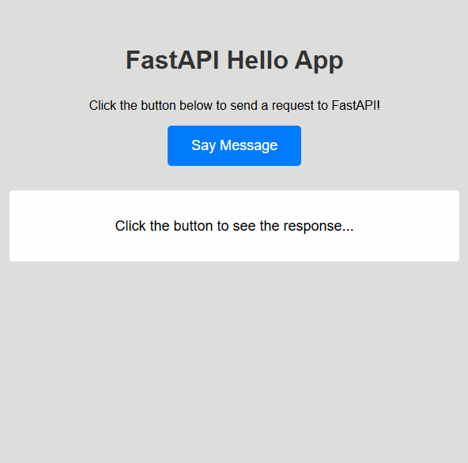
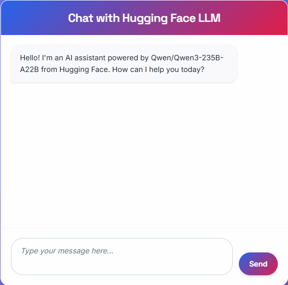

# FastAPI Learning Project

A few simple web applications built with FastAPI and JavaScript to demonstrate frontend-backend communication.

## Hello App

This is a simple web application with a "Say Hello" button. When clicked, JavaScript sends a request to a FastAPI backend, which runs a Python function that prints "Hello" to the console and returns the message back to the frontend to be displayed on the webpage.

## Hugging Face Chatbot App

A hugging face language model interface. Use of websockets for full-duplex connections, allowing for live updates from messaging between user and model. App uses python and FastAPI for the backend and HTML/CSS with Javascript for the frontend.

